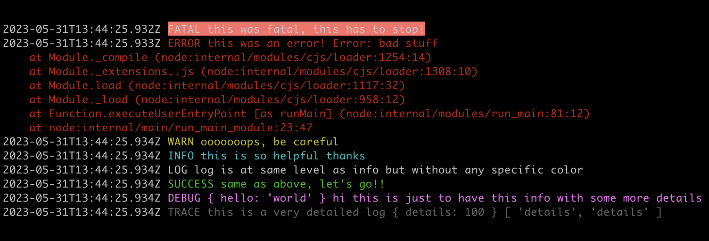

# node-chroma-logger <!-- omit in toc -->



## Table of Contents <!-- omit in toc -->

- [Presentation](#presentation)
- [Installation](#installation)
- [Technical information](#technical-information)
  - [Stack](#stack)
  - [Code quality](#code-quality)
  - [Tests](#tests)
  - [Security](#security)
- [Requirements](#requirements)
- [Usage](#usage)
  - [Environment variables](#environment-variables)
  - [Severities](#severities)
  - [Import](#import)
  - [Lib](#lib)
    - [fatal](#fatal)
    - [error](#error)
    - [warn](#warn)
    - [info](#info)
    - [log](#log)
    - [success](#success)
    - [debug](#debug)
    - [trace](#trace)
  - [Errors](#errors)
  - [Development](#development)
    - [Linting](#linting)
    - [Unit test](#unit-test)
- [Known issues](#known-issues)
- [Code of Conduct](#code-of-conduct)
- [Contributing](#contributing)
- [Support](#support)
- [Security](#security-1)
- [License](#license)

## Presentation

A zero-dependency minimalist asynchronous Node.js chromatic logger. When you want colors, don't want to use mainly synchronous logging methods of `Console` and get rid of a complex logger.

## Installation

`npm install --save node-chroma-logger`

## Technical information

### Stack

- Language: JavaScript ES6/ES7
- Node.js >= Dubnium (10.22.1)

### Code quality

Code style follows [Airbnb JavaScript Best Practices](https://github.com/airbnb/javascript) using ESLint.

### Tests

Mocha and Chai for unit testing.

### Security

- [Code security](https://docs.npmjs.com/packages-and-modules/securing-your-code) and most precisely module dependencies can be audited running `npm audit`.

## Requirements

- See [Stack](#stack)

## Usage

### Environment variables

| name | description | required | default |
| :--- | :---------- | :-------- | :----- |
| **NODE_CHROMA_LOGGER_DISABLE_COLOR** | Wether to disable setting color (escape sequences). It is especially needed if the terminal does not have the feature to display colors at all or you just don't want any color. It is always set to `false` so that terminals that are not detected as able to display colors like for Gitlab CI pipelines for an example can always have colors displayed. Accepted values: `true` or `1`. |  | `false` |
| **NODE_CHROMA_LOGGER_DISABLE_DATE_FORMAT** | Wether to disable showing date in the log format. Accepted values: `true` or `1`. |  | `false` |
| **NODE_CHROMA_LOGGER_DISABLE_SEVERITY_FORMAT** | Wether to disable showing severity in the log format. Accepted values: `true` or `1`. |  | `false` |
| **NODE_CHROMA_LOGGER_SEVERITY** | Logger severity selected. See logger [severities](#severities). Higher severities, if any, are activated. |  | `trace` |

### Severities

Sorted by highest to lowest severity.

| severity | description | color | data stream |
| :------- | :---------- | :---- | :---------- |
| **fatal** | The service/app is going to stop or become unusable now. An operator should definitely look into this soon. | `background light red` | `stderr` |
| **error** | Fatal for a particular request, but the service/app continues servicing other requests. An operator should look at this soon(ish). | `red` | `stderr` |
| **warn** | A note on something that should probably be looked at by an operator eventually. | `yellow` | `stderr` |
| **info** | Detail on regular operation. | `cyan` | `stdout` |
| **log** | Detail on regular operation. Same severity rank as `info`. | `default` | `stdout` |
| **success** | Detail on a successful operation. Same severity rank as `info`. | `green` | `stdout` |
| **debug** | Anything else, i.e. too verbose to be included in `info` severity. | `light magenta` | `stdout` |
| **trace** | Logging from external libraries used by the app or very detailed application logging. | `dark gray` | `stdout` |
| **disable** | Logging is disabled. | none | none |

### Import

```javascript
const logger = require('node-chroma-logger');
```

### Lib

- `logger` **<Object\>** with the following properties.

#### fatal

- `fatal(args)` **<Function\>**
  - `args` **<Any\>**

Example:

```javascript
logger.fatal('this was fatal, this has to stop!');
```

#### error

- `error(args)` **<Function\>**
  - `args` **<Any\>**

Example:

```javascript
logger.error('this was an error!', new Error('bad stuff'));
```

#### warn

- `warn(args)` **<Function\>**
  - `args` **<Any\>**

Example:

```javascript
logger.warn('ooooooops, be careful');
```

#### info

- `info(args)` **<Function\>**
  - `args` **<Any\>**

Example:

```javascript
logger.info('this is so helpful thanks');
```

#### log

- `log(args)` **<Function\>**
  - `args` **<Any\>**

Example:

```javascript
logger.log('log is at same level as info but without any specific color');
```

#### success

- `success(args)` **<Function\>**
  - `args` **<Any\>**

Example:

```javascript
logger.success('same as above, let\'s go!!');
```

#### debug

- `debug(args)` **<Function\>**
  - `args` **<Any\>**

Example:

```javascript
logger.debug({ hello: 'world' }, 'hi', 'this is just to have this info with some more details');
```

#### trace

- `trace(args)` **<Function\>**
  - `args` **<Any\>**

Example:

```javascript
logger.trace('this is a very detailed log', { details: 100 }, ['details', 'details']);
```

### Errors

None.

### Development

#### Linting

`npm run lint`

#### Unit test

`npm test`

## Known issues

/

## Code of Conduct

This project has a [Code of Conduct](.github/CODE_OF_CONDUCT.md). By interacting with this repository, organization, or community you agree to abide by its terms.

## Contributing

Please take a moment to read our [Contributing Guidelines](.github/CONTRIBUTING.md) if you haven't done so yet.

## Support

Please see our [Support](.github/SUPPORT.md) page if you have any questions or for any help needed.

## Security

For any security concerns or issues, please visit our [Security Policy](.github/SECURITY.md) page.

## License

[MIT](LICENSE.md).
